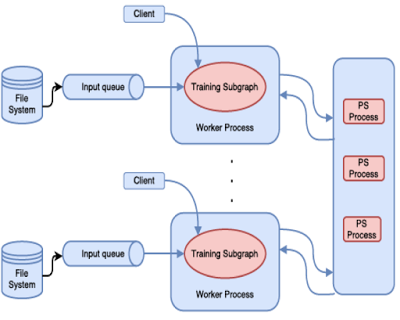
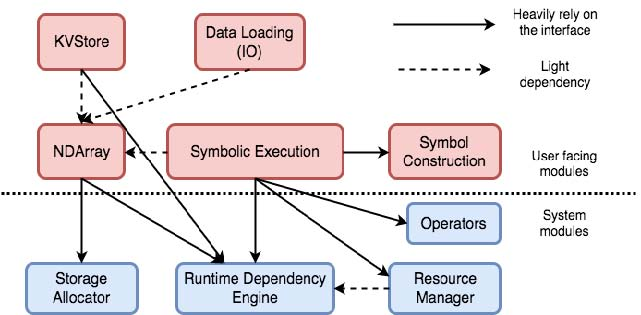
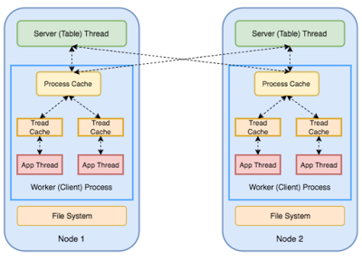

*作者：[Quan Chen](https://github.com/chenquan)*

# 分布式机器学习框架综述

最近公司业务中有做分布式机器学习的需求，相比单机的算法训练和算法调优来说分布式的方式将极大的提供我们的生产效率，加快模型的探索过程。

## 一. 深度学习

深度学习的分布式训练可以通过两种方式实现：数据并行化和模型并行化。

### 1. 数据并行化

数据并行化的目标是将数据集均等地分配到系统的各个节点（node），其中每个节点都有该神经网络的一个副本及其本地的权重。每个节点都会处理该数据集的一个不同子集并更新其本地权重集。这些本地权重会在整个集群中共享，从而通过一个累积算法计算出一个新的全局权重集。这些全局权重又会被分配至所有节点，然后节点会在此基础上处理下一批数据。

### 2. 模型并行化

模型并行化则是通过将该模型的架构切分到不同的节点上来实现训练的分布化。AlexNet 是使用模型并行化的最早期模型之一，其方法是将网络分摊到 2 个 GPU 上以便模型能放入内存中。当模型架构过大以至于无法放入单台机器且该模型的某些部件可以并行化时，才能应用模型并行化。

### 3. 深度学习分布式框架介绍

#### 3.1 TensorFlow

TensorFlow 是一个端到端开源机器学习平台。它拥有一个包含各种工具、库和社区资源的全面灵活生态系统，可以让研究人员推动机器学习领域的先进技术的发展，并让开发者轻松地构建和部署由机器学习提供支持的应用,同时它也是一个支持分布式深度学习的框架。

 TensorFlow 将计算表示为一个由节点和边组成的有向图。节点表示计算操作或可变状态（例如 Variable），边表示节点间通信的多维数组，这种多维数据称为"Tensor"。TensorFlow 需要用户静态地声明逻辑计算图，并通过将图重写和划分到机器上实现分布式计算。需说明的是，MXNet，特别是 DyNet，使用了一种动态定义的图。这简化了编程，并提高了编程的灵活性。 

  

 如上图所示，在 TensorFlow 中，分布式机器学习训练使用了参数 - 服务器方法。当在 TensorFlow 中使用 PS 抽象时，就使用了参数 - 服务器和数据并行。TensorFlow 声称可以完成更复杂的任务，但是这需要用户编写代码以通向那些未探索的领域 。

#### 3.2 TensorFlowOnSpark

>  *TensorFlowOnSpark为Apache Hadoop和Apache Spark集群带来了可扩展的深度学习。* 

*TensorFlowOnSpark* 是雅虎(Yahoo)开源的基于TensorFlow和Spark集群的分布式深度学习框架

通过将[TensorFlow](https://www.tensorflow.org/)深度学习框架中的突出功能与[Apache Spark](http://spark.apache.org/)和[Apache Hadoop相结合](http://hadoop.apache.org/)，TensorFlowOnSpark可以在GPU和CPU服务器集群上实现分布式深度学习。

它可以在Spark集群上同时进行分布式TensorFlow训练和推理，其目标是最大程度地减少在共享网格上运行现有TensorFlow程序所需的代码更改量。其Spark兼容API通过以下步骤帮助管理TensorFlow集群：

1. **启动** -在执行程序上启动Tensorflow主要功能，以及数据/控制消息的侦听器。
2. **数据获取**
   - **InputMode.TENSORFLOW** 利用TensorFlow的内置API直接从HDFS读取数据文件。
   - **InputMode.SPARK** 通过`TFNode.DataFeed`类将Spark RDD数据发送到TensorFlow节点。请注意，我们利用[Hadoop输入/输出格式](https://github.com/tensorflow/ecosystem/tree/master/hadoop)来访问HDFS上的TFRecords。
3. **关闭** -关闭执行程序上的Tensorflow工作程序和PS节点。

**优势**

 与替代的深度学习解决方案相比，TensorFlowOnSpark具有一些重要的优势 :

- 只需不到10行代码更改即可轻松迁移现有TensorFlow程序。
- 支持所有TensorFlow功能：同步/异步训练，模型/数据并行性，推理和TensorBoard。
- 服务器到服务器直接通信在可用时可以更快地学习。
- 允许HDFS上的数据集以及由Spark推送或由TensorFlow推送的其他来源。
- 轻松与您现有的Spark数据处理管道集成。
- 轻松部署在云或本地以及CPU或GPU上。

> 目前TensorFlowOnSpark已经支持最新版本的TensorFlow,即TensorFlow 2.0. 

#### 3.3 PyTorch

PyTorch 作为Facebook开源的深度学习框架，一经推出就获得业界的一致好评，Google也开始重新定义TensorFlow，继而推出了TensorFlow 2.0 支持动态图机制。
PyTorch基础了Caffe2和Torch的衣钵，在代码编写思路和灵活性上极为突出，因此在学术界使用的频率也逐年增加。
当前分布式的PyTorch仅支持Linux。默认情况下，会构建Gloo和NCCL后端并将其包含在PyTorch分布式中（仅在使用CUDA进行构建时才为NCCL）。MPI是一个可选的后端，仅当您从源代码构建PyTorch时才可以包括在内。（例如，在安装了MPI的主机上构建PyTorch。）

| Backend    | gloo | gloo | mpi  | mpi  | nccl | nccl |
| ---------- | ---- | ---- | ---- | ---- | ---- | ---- |
| Device     | CPU  | GPU  | CPU  | GPU  | CPU  | GPU  |
| send       | ✓    | ✘    | ✓    | ?    | ✘    | ✘    |
| recv       | ✓    | ✘    | ✓    | ?    | ✘    | ✘    |
| broadcast  | ✓    | ✓    | ✓    | ?    | ✘    | ✓    |
| all_reduce | ✓    | ✓    | ✓    | ?    | ✘    | ✓    |
| reduce     | ✓    | ✘    | ✓    | ?    | ✘    | ✓    |
| all_gather | ✓    | ✘    | ✓    | ?    | ✘    | ✓    |
| gather     | ✓    | ✘    | ✓    | ?    | ✘    | ✘    |
| scatter    | ✓    | ✘    | ✓    | ?    | ✘    | ✘    |
| barrier    | ✓    | ✘    | ✓    | ?    | ✘    | ✓    |

分布式的后端类型：

- 经验法则
  - 使用NCCL后端进行分布式**GPU**培训
  - 使用Gloo后端进行分布式**CPU**培训。
- 具有InfiniBand互连的GPU主机
  - 使用NCCL，因为它是当前唯一支持InfiniBand和GPUDirect的后端。
- 具有以太网互连的GPU主机
  - 使用NCCL，因为它目前提供最佳的分布式GPU训练性能，尤其是对于多进程单节点或多节点分布式训练。如果您在使用NCCL时遇到任何问题，请使用Gloo作为后备选项。（请注意，对于GPU，Gloo当前的运行速度比NCCL慢。）
- 具有InfiniBand互连的CPU主机
  - 如果您的InfiniBand已启用IB上的IP，请使用Gloo，否则，请使用MPI。我们计划在即将发布的版本中增加InfiniBand对Gloo的支持。
- 具有以太网互连的CPU主机
  - 除非有特殊原因，否则请使用Gloo。

#### 3.4 MXNet

MXNet 是一个协同开源项目，源自于在 2015 年出现的 CXXNet、Minverva 和 Purines 等深度学习项目，目前托管到Apache基金会名下开发和维护，是一个旨在*提高效率*和*灵活性*的深度学习框架 。类似于 TensorFlow，MXNet 也是一种数据流系统，支持具有可变状态的有环计算图，并支持使用参数 - 服务器模型的训练计算。同样，MXNet 也对多个 CPU/GPU 上的数据并行提供了很好的支持，并可实现模型并行。MXNet 支持同步的和异步的训练计算。下图显示了 MXNet 的主要组件。其中，运行时依赖引擎分析计算过程中的依赖关系，对不存在相互依赖关系的计算做并行处理。MXNet 在运行时依赖引擎之上提供了一个中间层，用于计算图和内存的优化。 

MXNet 使用检查点机制支持基本的容错，提供了对模型的 save 和 load 操作。save 操作将模型参数写入到检查点文件，load 操作从检查点文件中读取模型参数。

MXNet 使用描述式编程语言表述计算为一个有向图，也支持使用一些指令式编程去定义 tensor 的计算和控制流。MXNet 提供了多种语言（例如 C++、Python、R 和 Scala 等）编写的客户端 API。与 TensorFlow 一样，MXNet 的后台核心引擎库同样是使用 C++ 编写的。

 

 

## 二. (传统)机器学习

刚刚说了深度学习的分布式框架,现在来谈谈传统机器学习的分布式框架.

### 1.  Spark 

 Spark 是为通用数据处理而设计的，并非专用于机器学习任务 ，所以真正意义下Spark不是一个机器学习框架。 要在 Spark 上运行机器学习任务，可以使用 MLlib for Spark。  如果采用基本设置的 Spark，那么模型参数存储在驱动器节点上，在每次迭代后通过工作者和驱动器间的通信更新参数。如果是大规模部署机器学习任务，那么驱动器可能无法存储所有的模型参数，这时就需要使用 RDD 去容纳所有的参数。这将引入大量的额外开销，因为为了容纳更新的模型参数，需要在每次迭代中创建新的 RDD。更新模型会涉及在机器和磁盘间的数据 Shuffle，进而限制了 Spark 的扩展性。这正是基本数据流模型（即 DAG）的短板所在。Spark 并不能很好地支持机器学习中的迭代运算。 

### 2. spark-sklearn

Scikit-learn是传统机器学习算法中常用的框架,但是,Scikit-learn的优势通常在于单个节点上的计算领域。对于某些常见方案，例如参数调整，可以并行运行大量小任务。这些场景对应Spark简直完美,因此将Spark和Scikit-learn结合,使用Spark集群对训练任务进行分工和调度将会加快训练过程.
由[Databricks](https://databricks.com/)开源的spark-sklearn框架,它结合了Spark和scikit-learn的优势,无需更改用户代码就可实现分布式训练。它重新实现了scikit-learn的某些组件,用户将看到与scikit-learn的交叉验证工具完全兼容的基于Spark的交叉验证器类。通过交换单个类导入，用户可以为他们现有的scikit-learn工作流分配交叉验证。

### 3. XGBoost

XGBoost是由陈天奇大佬开发并开源的分布式梯度提升库, 旨在**高效**，**灵活**且**可移植**。它在[Gradient Boosting](https://en.wikipedia.org/wiki/Gradient_boosting)框架下实现了机器学习算法。XGBoost提供了并行树增强（也称为GBDT，GBM），可快速准确地解决许多数据科学问题。相同的代码在主要的分布式环境（Hadoop，SGE，MPI）上运行，并且可以解决数十亿个示例之外的问题。 

XGBoost目前可以说是各大数据科学竞赛的夺冠神器,许多冠军团队都有使用到它,并且在工业领域运用也是非常广.

### 4. LightGBM

LightGBM基于决策树算法的快速，分布式，高性能梯度提升（GBT，GBDT，GBRT，GBM或MART）框架，用于排名，分类和许多其他机器学习任务。 

LightGBM是微软开源的基于树的学习算法的梯度提升框架,作为数据科学竞赛和工业领域落地实现的后起之秀,凭借着其训练速度更快，效率更高,降低内存使用率等特性在XGBoost独霸天下的情况下也分得了一杯羹.除此之外,LightGBM同样是一个支持并行和GPU学习,能够处理大规模数据的分布式框架.

### 5. PMLS
PMLS 是专门为机器学习任务而设计的。它引入了称为`"参数 - 服务器"（Parameter-Server，PS）`的抽象，这种抽象是为了支持迭代密集的训练过程。

  

PS（在图中以绿色方框所示）以分布式` key-value `数据表形式存在于内存中，它是可复制和分片的。每个节点（node）都是模型中某个分片的主节点（参数空间），并作为其它分片的二级节点或复制节点。这样 PS 在节点数量上的扩展性很好。

PS 节点存储并更新模型参数，并响应来自于工作者的请求。工作者从自己的本地 PS 拷贝上请求最新的模型参数，并在分配给它们的数据集分区上执行计算。

PMLS 也采用了 SSP（Stale Synchronous Parallelism）模型。相比于 BSP（Bulk Synchronous Parellelism）模型 ，SSP 放宽了每一次迭代结束时各个机器需做同步的要求。为实现同步，SSP 允许工作者间存在一定程度上的不同步，并确保了最快的工作者不会领先最慢的工作者 s 轮迭代以上。由于处理过程处于误差所允许的范围内，这种非严格的一致性模型依然适用于机器学习。